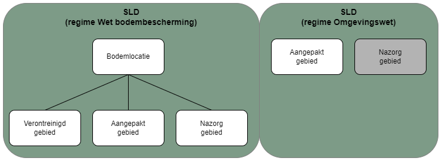
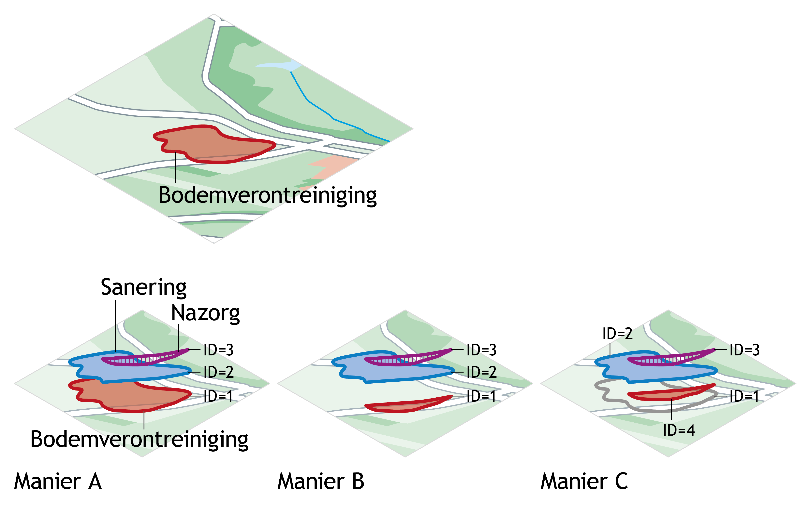

[h2 is vereist vanwege ReSpec]: #
<h2>Overheidsbesluit bodemverontreiniging</h2>

# Inleiding
De catalogus voor het 'Overheidsbesluit bodemverontreiniging' beschrijft de gegevens die in de registratie ondergrond zijn opgenomen over een gebied waarin bodemverontreiniging is geconstateerd en/of aangepakt vanuit het vakgebied milieukwaliteit. 

Op 1 januari 2024 is de Omgevingswet (Ow) in werking getreden. De Wet bodembescherming (Wbb) is hierin opgegaan. Een deel van de dossiers over bodemverontreinigingen is in de zogenaamde ‘warme overdracht’ overgedragen naar een nieuw bevoegd gezag (doorgaans van provincie naar een gemeente). Voor een ander deel van deze dossiers geldt overgangsbeleid onder het regime van de Wbb. Vanaf 1 januari 2024 wordt ook nieuwe informatie gegenereerd onder het regime van de Ow. We herkennen drie mogelijke categorieën van type gegevens die binnen SLD mogelijk zijn. Bij het opstellen van de catalogus is rekening gehouden met deze drie categorieën van gegevens:
- Ontstaan vóór 1-1-2024 onder het regime van de Wbb, afgerond en daarmee statisch. Zo nodig onderdeel van ‘warme overdracht’ naar nieuw bevoegd gezag Ow. 
- Ontstaan vóór 1-1-2024 onder het regime van de Wbb, nog lopend en vervolg onder het overgangsrecht op basis van het regime Wbb.
- Ontstaan na 1-1-2024 onder het regime van de Ow.

De term voor het registratieobject ‘Overheidsbesluit bodemverontreiniging’ heeft een bredere betekenis dan alleen het formele besluit dat door de overheid is genomen. Een overheidsbesluit bodemverontreiniging bestaat uit de gegevens die bepalend zijn geweest in de procedure van een bevoegd gezag bij de beoordeling en/of afhandeling van bodemverontreiniging. Dit omvat de gegevens die onderdeel zijn van een formele beschikking, maar ook gegevens die een bevoegd gezag vastlegt zonder dat er een formele beschikking op is afgegeven (zoals bijvoorbeeld onder het regime van de Ow). De locatie is vastgelegd bij [Bodemlocatie](#bodemlocatie) (regime Wbb) of bij [Aangepakt gebied](#aangepakt-gebied) (regime Ow). Onder het Wbb regime kunnen besluiten en extra gegevens worden geregistreerd over het verontreinigd gebied, aangepakt gebied of nazorggebied. Onder het regime van de Ow beperkt de registratie in de BRO zich tot het aangepakt gebied. Nazorg onder de Omgevingswet is in deze versie van de catalogus buiten scope.

<figure>
	
	<figcaption>Overheidsbesluit bodemverontreiniging in deze versie van de catalogus; nazorg onder de Omgevingswet is buiten scope.</figcaption>
</figure>

## Verontreinigingscontouren (Wbb) in de registratie
De registratie van de aanpak van een verontreiniging onder de Wet bodembescherming (Wbb) gebeurt in de huidige praktijk op verschillende manieren. 
Wanneer een verontreiniging in zijn geheel is verwijderd, krijgt de verontreinigingscontour een einddatum. In het verleden is deze einddatum niet altijd vastgelegd.
Wanneer in de aanpak van een bodemverontreiniging de verontreiniging gedeeltelijk is verwijderd, kan dat op verschillende manieren worden geregistreerd. In het verleden werd de historie vaak niet vastgelegd en bleef de bestaande verontreinigingscontour ongewijzigd bestaan in de registratie (manier A). In de nieuwe praktijk wordt de bestaande verontreinigingscontour verkleind (manier B) of de bestaande verontreinigingscontour wordt beëindigd en de restverontreiniging wordt als nieuwe contour geregistreerd (manier C).

<figure>
	
	<figcaption>Registratie contouren aanpak bodemverontreiniging onder de Wet bodembescherming.</figcaption>
</figure>

## Aangepakte gebieden (Ow) in de registratie
Het aangepakt gebied onder de Omgevingswet is het resultaat van een uitgevoerde bodemsanering of ontgraving (in meer dan 25m3 grond boven de interventiewaarde). Wanneer binnen een sanering verschillende aanpakken worden toegepast, bijvoorbeeld een deel van de verontreiniging wordt ontgraven en een ander deel wordt afgedekt, kan dat op twee verschillende manieren worden geregistreerd. De deelgebieden worden apart geregistreerd met ieder een eigen aanpak, of de gebieden worden als één geheel geregistreerd met de aanduiding 'gecombineerde aanpak'.

<figure>
	
	<figcaption>Registratie aangepakt gebied onder de Omgevingswet; als twee aparte deelgebieden met ieder een eigen aanpak, of als één geheel met de aanduiding 'gecombineerde aanpak'.</figcaption>
</figure>

# Belangrijkste entiteiten

## Overheidsbesluit bodemverontreiniging
Deze entiteit bevat de gegevens die het registratieobject identificeren en inzicht geven in de totstandkoming en context van het object voorafgaand aan opname in de registratie ondergrond. Kader aanlevering is daarbij bepalend voor de inhoud van de registratie van de gegevens onder het regime van Wbb, danwel Ow. Deze entiteit bevat twee gegevensgroepen; de _Registratiegeschiedenis_ (BRO generiek) en de _Gestandaardiseerde locatie_ (BRO generiek).
Zoals aangegeven in de inleiding kunnen gegevens zijn ontstaan onder twee verschillende wettelijke regimes: Wbb of Ow. Registraties die ontstaan zijn onder het regime van de Wbb (ongeacht of de aanpak is afgerond of dat sprake is van overgangsrecht) worden als Bodemlocatie opgenomen. Registraties die zijn ontstaan onder het regime van de Ow worden vastgelegd als Aangepakt gebied.

## Registratiegeschiedenis
De registratiegeschiedenis van een 'Overheidsbesluit bodemverontreiniging' geeft de essentie van de geschiedenis van het object in de registratie ondergrond, de formele geschiedenis. De registratiegeschiedenis vertelt bijvoorbeeld wanneer een object is geregistreerd en of er na registratie correcties zijn doorgevoerd. Deze gegevensgroep wordt niet aangeleverd maar intern binnen de basisregistratie ondergrond gegenereerd.

## Gestandaardiseerde locatie
De geometrie van een 'Overheidsbesluit bodemverontreiniging' kan worden aangeleverd ten opzichte van twee referentiestelsels (RD en ETRS89). Binnen de BRO worden gegevens die aangeleverd zijn op basis van RD volgens een gedefinieerde methodiek omgezet naar ETRS89. Deze bewerking vindt plaats binnen de BRO zodat aan de uitgiftekant altijd kan worden uitgeleverd in ETRS89 én het oorspronkelijk aangeleverde referentiestelsel. De gestandaardiseerde locatie wordt op basis van de aanlevering automatisch vastgelegd, evenals de methode volgens welke de transformatie is uitgevoerd.

## Bodemlocatie
Deze entiteit beschrijft de eenheid (of aggregatie van kleinere eenheden) die als één geheel is aangepakt bij het onderzoek naar en de aanpak van bodemverontreiniging onder de Wbb. De entiteit bevat een aantal algemene gegevens die betrekking hebben op het registratieobject zelf, zoals: de unieke identificatie (zowel binnen het bodeminformatiesysteem als in de dossiers van het bevoegd gezag), de naam en de ruimtelijke begrenzing van de locatie. Tevens bevat deze entiteit de zogenaamde ‘SIKB0101-identificatie’ (een unieke identificatie in de vorm van een GUID) waaronder de bodemlocatie in de ketensystemen is vastgelegd. Daarnaast bevat de entiteit enkele gegevens die betrekking hebben op de afhandeling door bevoegd gezag zoals de vervolgactie.

## Besluit
Deze entiteit wordt alleen vastgelegd bij gegevens die zijn aangeleverd onder het regime van de Wbb, en bevat de gegevens van besluiten en beschikkingen zoals door het bevoegd gezag zijn vastgelegd. Dit zijn doorgaans besluiten die zijn genomen in het kader van de Wbb over de vaststelling en aanpak van de bodemverontreiniging.
Deze entiteit bevat de gegevens die het besluit identificeren (unieke SIKB0101-identificatie en kenmerk van het besluit) en inzicht geven in het besluittype en de datum waarop het besluit bekend is gemaakt.

## Verontreinigd gebied
Deze entiteit wordt alleen vastgelegd bij gegevens die zijn aangeleverd onder het regime van de Wbb, en bevat de gegevens van de bodemverontreiniging zoals afgebakend met een verontreinigingscontour. De entiteit bevat onder meer een aantal gegevens om het gebied te identificeren (SIKB0101-identificatie) en die aangeven wat de aard en omvang van de verontreiniging is: overschreden toetsingswaarde, de datum waarop de verontreiniging is vastgesteld, compartiment en dieptetraject.

## Aangepakt gebied
Deze entiteit bevat de gegevens van de uitgevoerde bodemsanering of ontgravingn (Ow: graven in meer dan 25m3 in grond boven de interventiewaarde). Het gebied wordt beschreven aan de hand van enkele unieke kenmerken zoals SIKB0101-identificatie, contour en compartiment. Daarnaast worden enkele gegevens over de aanpak genoemd: begin- en einddiepte, type saneringsaanpak, einddatum van de werkzaamheden. Onder het regime van de Ow wordt de koppeling naar het onderliggend evaluatieverslag, geregistreerd in de BRO als milieuhygiënisch bodemonderzoek (SAD), vastgelegd.

## Nazorggebied
Deze entiteit wordt alleen vastgelegd bij gegevens die zijn aangeleverd onder het regime van de Wbb, en bevat de gegevens van de vastgestelde nazorg en eventuele beperkingen die na afloop van de sanering zijn opgelegd. Naast identificerende kenmerken (SIKB0101-identificatie en contour) is het mogelijk aan te geven hoe lang de nazorg van toepassing is en op welke datum deze in werking is getreden. In de bijbehorende nazorgmaatregel kan worden gespecificeerd welke gebruiksbeperking is opgelegd.

# INSPIRE
Het doel van de Europese kaderrichtlijn INSPIRE is het harmoniseren en openbaar maken van ruimtelijke gegevens van overheidsorganisaties ten behoeve van het milieubeleid. Het registratieobject overheidsbesluit bodemverontreiniging valt onder het  INSPIRE-thema ‘Area management/restriction/regulation zones and reporting units’. De gegevens zullen worden aangeleverd vanuit de BRK-PB.
